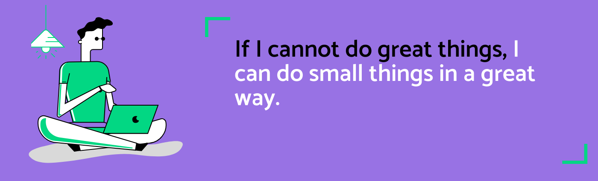

<h1 align="center">Hello I'm Anurag Shukla</h1>

<!--
**aks1817/aks1817** is a ✨ _special_ ✨ repository because its `README.md` (this file) appears on your GitHub profile.
Here are some ideas to get you started: -->

  
  

  

## 👨🏻‍💻 About Me:

 

- 🙋‍♂️ All about me is at **[My Website](https://shukla1817.netlify.app)**

- 🌱 I’m currently learning `MERN Stack`

- 👯 I’m looking to collaborate for `Dev Projects`

- 👨‍💻 Life Hack: Learn new tech :fire: and share what you have learned :tada:

## 🛠️ Technologies and Tools I use:

## ❤️ Let's get connected:

 
 

